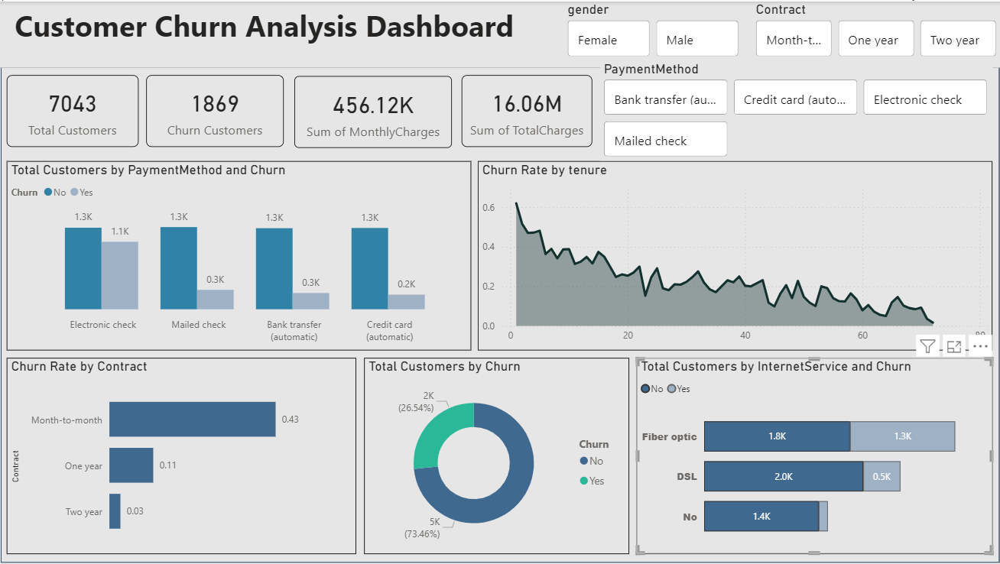

# 📊 Telco Customer Churn Analysis

## 📌 Project Overview

This project focuses on analyzing customer churn behavior in a telecom company using **SQL and Power BI**. The objective is to identify key factors influencing churn and provide actionable insights to improve customer retention.

---

## 🎯 Business Objectives

* Identify key drivers of customer churn
* Segment high-risk customers
* Analyze impact of contract types, payment methods, and services
* Provide data-driven recommendations to reduce churn

---

## 🛠️ Tools & Technologies

* **SQL (MySQL)** – Data analysis & querying
* **Power BI** – Data visualization & dashboarding
* **Excel** – Data preprocessing
* **GitHub** – Project version control

---

## 📊 Key Metrics (KPIs)

* **Total Customers:** 7043
* **Churn Customers:** 1869
* **Churn Rate:** ~26.5%
* **Average Monthly Charges**
* **Customer Lifetime Value (CLV)**


---


### 🔍 Critical Business Insights

* 🚨 **Month-to-Month Contracts**

  * Churn Rate: **~43%**
  * 👉 Highest risk segment

* 💳 **Payment Method Risk**

  * Electronic check users show **highest churn**
  * 👉 Indicates low customer commitment

* 🌐 **Internet Service Impact**

  * Fiber optic users churn more than DSL users
  * 👉 Possible service dissatisfaction

* ⏳ **Customer Tenure Effect**

  * Customers with **< 12 months tenure** have highest churn
  * 👉 Early-stage customers are most vulnerable

---

### 💰 Revenue Impact

* 💸 Estimated Monthly Revenue Loss due to churn

  * Derived from churned customers’ charges
  * 👉 Significant business impact

---

### ⚠️ High-Risk Customer Segment

Customers with:

* Tenure < 12 months
* Monthly Charges > 70

👉 These customers are **most likely to churn and should be targeted immediately**

---

## 🎯 Final Business Conclusion

* Customer churn is heavily driven by:

  * Short-term contracts
  * High monthly charges
  * Low tenure

👉 Focusing on **customer retention strategies in the first 12 months** can significantly reduce churn.


## 🧠 SQL Analysis (Key Highlights)

### 📌 Churn Rate Calculation

```sql
SELECT
    ROUND(
        COUNT(CASE WHEN Churn = 'Yes' THEN 1 END) * 100.0 / COUNT(*),
        2
    ) AS churn_rate
FROM telco_churn;
```

### 📌 Customer Segmentation by Contract

```sql
SELECT
    Contract,
    COUNT(*) AS total_customers,
    SUM(CASE WHEN Churn = 'Yes' THEN 1 ELSE 0 END) AS churn_customers
FROM telco_churn
GROUP BY Contract;
```

### 📌 High-Risk Customer Identification

```sql
SELECT
    customerID,
    tenure,
    MonthlyCharges
FROM telco_churn
WHERE tenure < 12
  AND MonthlyCharges > 70
  AND Churn = 'Yes';
```

### 📌 Revenue Loss Due to Churn

```sql
SELECT
    ROUND(SUM(MonthlyCharges), 2) AS revenue_lost
FROM telco_churn
WHERE Churn = 'Yes';
```

### 📌 Advanced SQL (Window Function)

```sql
SELECT
    PaymentMethod,
    SUM(CASE WHEN Churn = 'Yes' THEN 1 ELSE 0 END) AS churn_customers,
    RANK() OVER (ORDER BY SUM(CASE WHEN Churn = 'Yes' THEN 1 ELSE 0 END) DESC) AS churn_rank
FROM telco_churn
GROUP BY PaymentMethod;
```

---

## 📊 Dashboard

Power BI dashboard provides interactive visualizations for:

* Churn trends
* Customer segmentation
* Revenue impact
* Service-based analysis


## 📸 Dashboard Preview


---


## 👨‍💻 About Me

**Abhishek Reddy**
📊 Aspiring Data Analyst

🔗 LinkedIn: [www.linkedin.com/in/abhishekreddy111](http://www.linkedin.com/in/abhishekreddy111)
🔗 GitHub: https://github.com/AbhishekReddy902

---

## ⭐ Support

If you found this project useful, please give it a ⭐ on GitHub!

